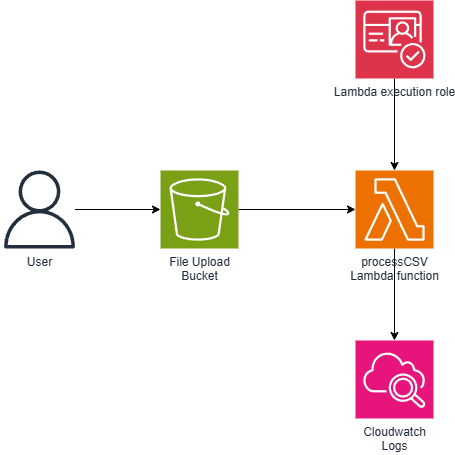

# S3 to Lambda

## Architecture

This project sets up:
- An S3 bucket to receive uploads
- A Lambda function (Python) triggered by S3 `ObjectCreated` events
- IAM permissions for secure access
- All defined in Pulumi (Python)



## Deployment Instructions

### 0. Prerequisites

- Python 3.8+
- Pulumi CLI
- AWS CLI (`aws configure` setup)

### 1. Clone the Repository

```bash
git clone <repository-url>
cd <repository-folder>
```

### 2. Install Python dependencies

```bash
pip install -r requirements.txt
```

### 3. Configure AWS Credentials
For Linux/macOS:
```
export AWS_ACCESS_KEY_ID=your_access_key_id
export AWS_SECRET_ACCESS_KEY=your_secret_access_key
export AWS_REGION=us-east-1
```

For Windows:
```
$Env:AWS_ACCESS_KEY_ID="your_access_key_id"
$Env:AWS_SECRET_ACCESS_KEY="your_secret_access_key"
$Env:AWS_REGION="us-east-1"
```

### 4. Deploy infraestructure
```
pulumi up
```